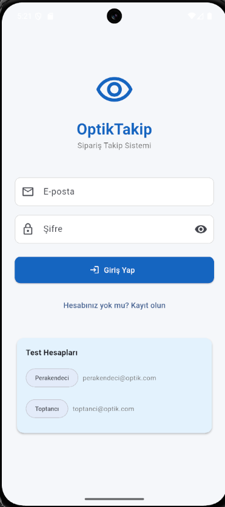
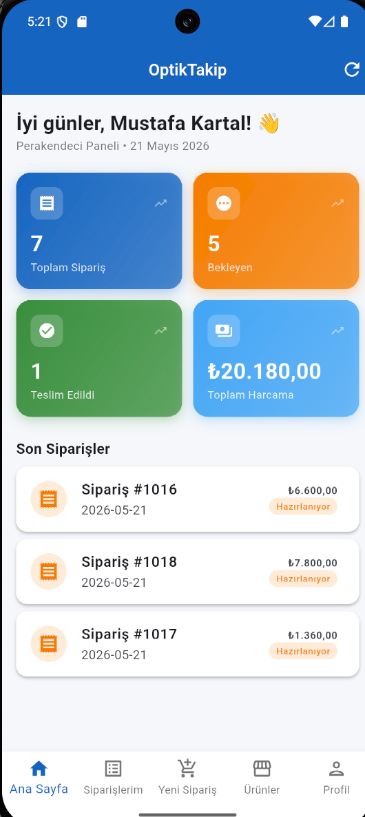
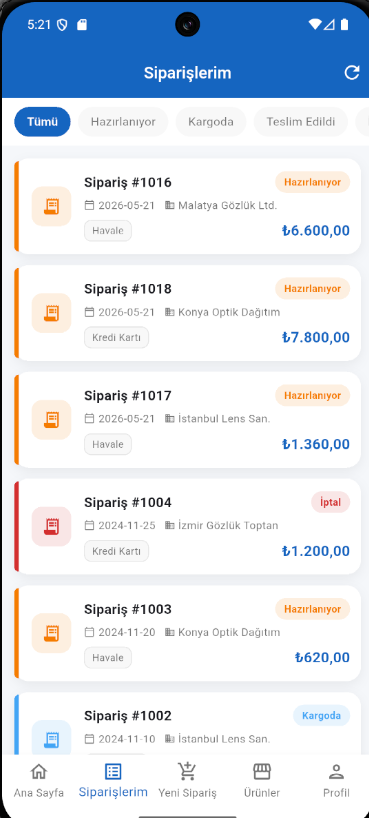
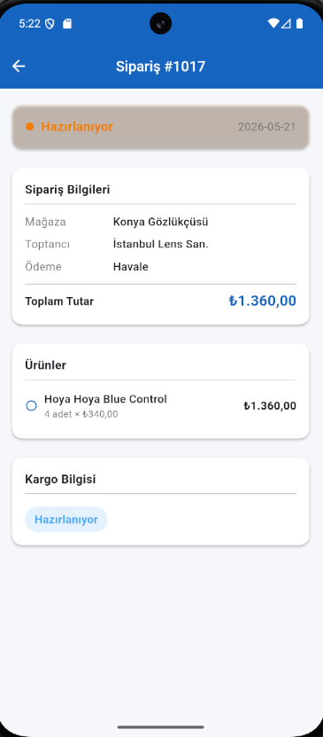
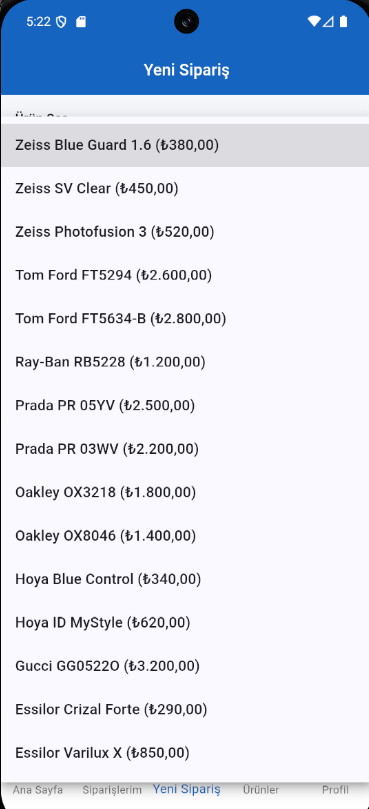
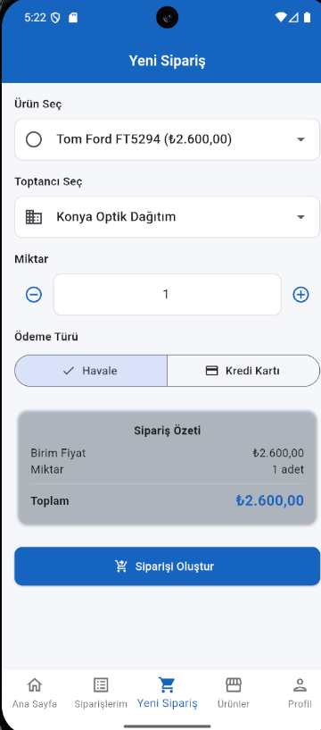
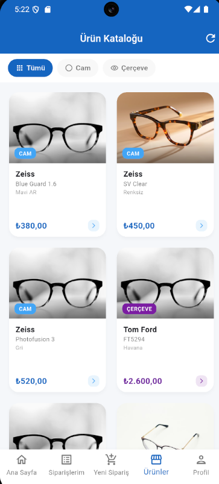
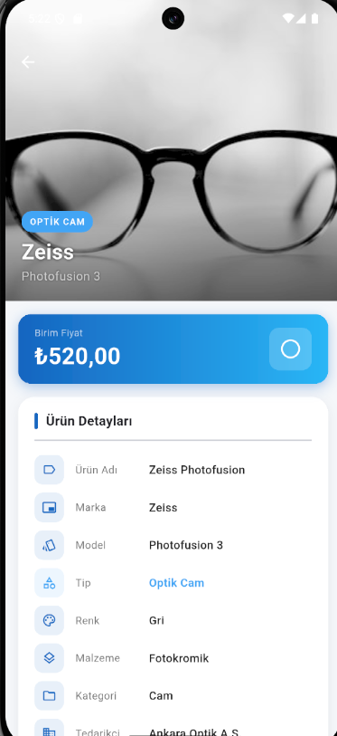
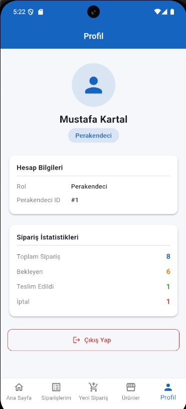

https://github.com/user-attachments/assets/b607bdec-74a9-4ec1-8c05-056c1e983743

# OptikTakip — Optik Mağazası Sipariş Takip Sistemi

## Öğrenci Bilgileri
- **Ad Soyad:** Mustafa Kartal  
- **Öğrenci No:** 243301046  
- **Ders:** Mobil Programlama Final Projesi 2026  

---

## Uygulama Açıklaması

Flutter + Supabase ile geliştirilmiş optik mağazası sipariş takip sistemi.  
İki farklı kullanıcı rolü destekler: **Perakendeci** (optik mağazası) ve **Toptancı** (tedarikçi).

---

## Test Hesapları

| Rol | E-posta | Şifre |
|-----|---------|-------|
| Perakendeci | perakendeci@optik.com | Optik2026! |
| Toptancı | toptanci@optik.com | Optik2026! |

---

## Kullanılan Paketler

| Paket | Sürüm | Kullanım Amacı |
|-------|-------|----------------|
| supabase_flutter | ^2.5.0 | Backend (Auth + PostgreSQL) |
| provider | ^6.1.2 | State management |
| go_router | ^13.2.0 | Sayfa yönlendirme |
| intl | ^0.19.0 | Para birimi ve tarih formatı |
| flutter_spinkit | ^5.2.1 | Yükleme animasyonları |
| badges | ^3.1.2 | Bildirim rozeti |

---

## Ekranlar (10 Ekran)

1. **Giriş Ekranı** — E-posta/şifre ile giriş, test hesap kısayolları  
2. **Kayıt Ekranı** — Rol seçimi (Perakendeci/Toptancı), bilgi formu  
3. **Ana Sayfa** — Dashboard: sipariş/stok özet kartları (role göre farklı)  
4. **Siparişlerim** — Sipariş listesi, durum filtreleme (Perakendeci) / Tüm siparişler + durum güncelleme (Toptancı)  
5. **Sipariş Detay** — Ürün satırları, toplam tutar, kargo bilgisi  
6. **Yeni Sipariş** — Ürün/toptancı seç, miktar, ödeme türü (Perakendeci)  
7. **Ürün Kataloğu** — Cam/Çerçeve filtreli grid görünüm, gerçek ürün fotoğrafları  
8. **Ürün Detay** — Hero fotoğraf, fiyat bandı, tüm ürün özellikleri, sipariş ver butonu  
9. **Stok Yönetimi** — KRİTİK/DÜŞÜK/NORMAL renk kodlaması, miktar güncelleme (Toptancı)  
10. **Profil** — Kullanıcı bilgileri, sipariş istatistikleri, çıkış  

---

## Rol Bazlı Özellikler

### Perakendeci
- Kendi siparişlerini görüntüler
- Yeni sipariş oluşturur (`create_siparis` Supabase function)
- Sipariş detayı + kargo takibi görür
- Ürün kataloğunu inceler

### Toptancı
- Kendisine gelen tüm siparişleri görür
- Sipariş durumunu günceller (Hazırlanıyor → Kargoda → Teslim Edildi)
- Stok yönetimi yapar (renk kodlu durum: KRİTİK / DÜŞÜK / NORMAL)
- Ürün kataloğunu görür

---

## Teknik Özellikler

- **Session Kalıcılığı:** `supabase_flutter` oturumu otomatik saklar; uygulama kapatılıp açıldığında giriş devam eder
- **Log Kaydı:** Her işlem `islem_log` tablosuna yazılır (LOGIN, LOGOUT, SIPARIS_OLUSTUR, STOK_GUNCELLE vb.)
- **RLS:** Supabase Row Level Security ile rol bazlı veri erişimi
- **Trigger:** Sipariş iptalinde stok otomatik iade edilir
- **İki Rol:** `perakendeci` ve `toptanci` rolleri farklı navigasyon yapısı gösterir

---

## Kurulum

### 1. Supabase Kurulumu

1. [supabase.com](https://supabase.com) üzerinde yeni proje oluşturun  
2. **SQL Editor** → `supabase_setup.sql` dosyasını yapıştırıp çalıştırın  
3. **Authentication → Users → Add User** ile test kullanıcılarını ekleyin:
   - `perakendeci@optik.com` / `Optik2026!`
   - `toptanci@optik.com` / `Optik2026!`
4. Her kullanıcının **UUID'sini kopyalayın** ve `supabase_setup.sql` dosyasının sonundaki `profiles` INSERT'lerini çalıştırın
5. **Project Settings → API** sayfasından `URL` ve `anon key` değerlerini kopyalayın

### 2. Flutter Kurulumu

1. `lib/core/constants.dart` dosyasını açın
2. `supabaseUrl` ve `supabaseAnonKey` değerlerini Supabase'den kopyaladıklarınızla değiştirin:
   ```dart
   const String supabaseUrl = 'https://XXXXXXXXXXX.supabase.co';
   const String supabaseAnonKey = 'eyJhbGci...';
   ```
3. Terminal'de proje klasöründe çalıştırın:
   ```bash
   flutter pub get
   flutter run
   ```

---

## Tanıtım Videosu

<video src="video.mp4" controls width="360">
</video>

---

## Ekran Görüntüleri

### Giriş Ekranı


### Ana Sayfa — Perakendeci


### Siparişlerim


### Sipariş Detay


### Yeni Sipariş — Ürün Seçimi


### Yeni Sipariş — Form


### Ürün Kataloğu


### Ürün Detay


### Profil


---

## GitHub Repo
`243301046_MustafaKartal_Flutter_Proje`

---

## Veritabanı Şeması

`OptikSatis` veritabanı MS SQL Server'dan Supabase PostgreSQL'e taşındı.  
Tablolar: `toptanci`, `perakendeci`, `urun_kategori`, `urun`, `stok`, `siparis`, `siparis_detay`, `kargo`, `profiles`, `islem_log`
